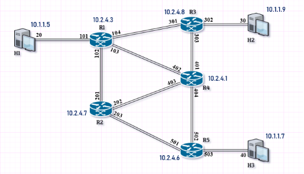

# Network emulator - MPLS
This application has been created as a part of "Transport and Control in Telecommunication Networks" course.
## Brief description
This project aimed at showing how Multiprotocol Label Switching technology works. 
We put much emphasis on the vital aspect of MPLS i.e. label: swapping, pushing and popping. 
Application consists of (checked modules created by myself):
- [x] Cable cloud for packet forwarding
- [x] Management system for management and configuration with GUI
- [ ] Nodes (routers)
- [ ] Hosts.

Each instance of above modules (also depicted on Fig. 1) opens a seperate TCP socket for receiving and forwarding incoming MPLS packets. Application is written in .NET environment using C# language.
|  |
|:--:|
|*Fig. 1. Network topology*|

## Usage
* Build each project's solution: ```dotnet build <SolutionName.sln>```, so that ```~\bin``` folder is created
* To run application use attached batch file: ```run.bat```

## References
* [Asynchronous server socket](https://docs.microsoft.com/pl-pl/dotnet/framework/network-programming/asynchronous-server-socket-example)
* [MPLS RFC](https://tools.ietf.org/html/rfc3031)
 
## Authors
Piotr Chojnowski, Kamil Dębek, Krzysztof Sadura


