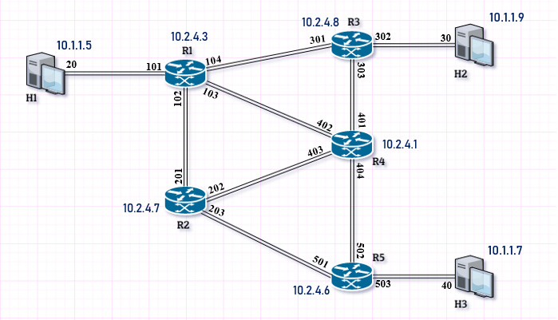

# Network emulator - MPLS
This application has been created as a part of TSST course. 

|  |
|:--:|
|*Network topology*|

Application consists of:
* Cable cloud for packet forwarding
* Management system for management and configuration
* Nodes (routers)
* Hosts

